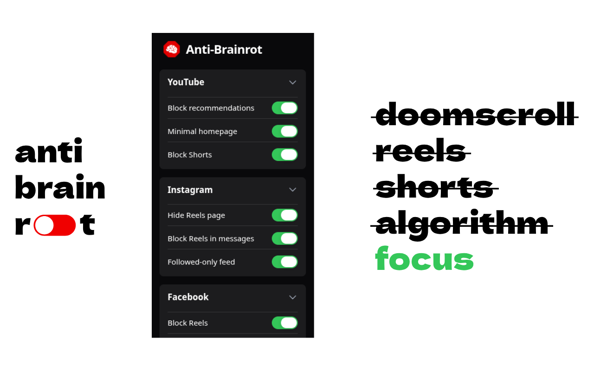
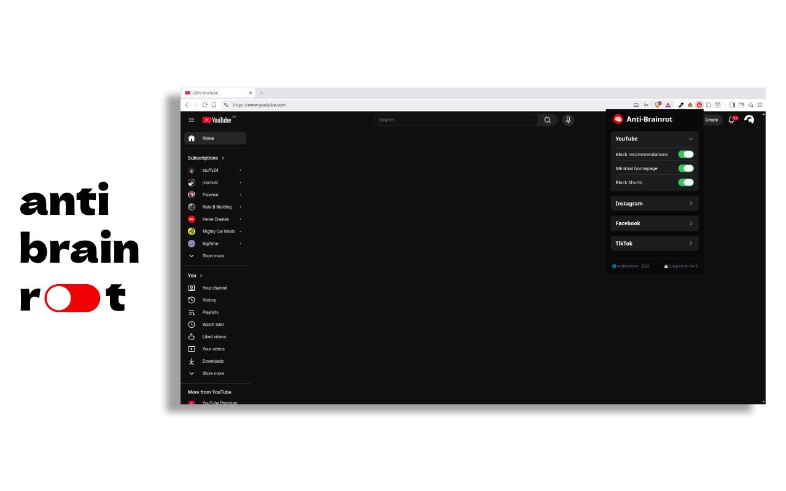
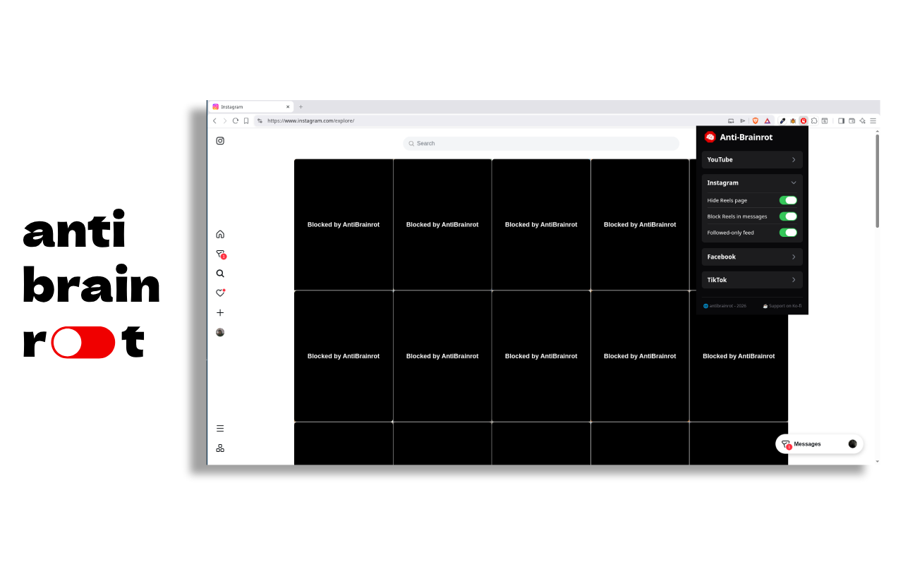

# 🧠 Anti-Brainrot for Social Media - Block Shorts & Feed

_Anti-Brainrot is a browser extension designed to improve your online experience by blocking algorithmic feed that is engineered to keep you addicted. Join the anti brainrot movement._

**Get it on Chrome Webstore:** [chromewebstore.google.com](https://chromewebstore.google.com/detail/ocbnhbkeniofdlnjhenmhibejdillfaf)

## Features

#### **YouTube**

- Block YouTube Recommended Contents
- Minimal Homepage design
- Block YouTube Shorts

#### **Instagram:**

- Hide Reels Page
- Block Reels in Messages
- Hide "For you" page contents (Followed people only)

#### **Facebook:**

- Block Facebook Reels
- Marketplace mode only

#### **TikTok:**

- Block TikTok Site

## Supported Platforms

- YouTube
- Instagram
- TikTok
- Facebook

## Showcase

## Developer's Note

Hi there! If you'd like to contribute, feel free to fork the repository and submit a pull request. Improvements, bug fixes, and new features are always welcome.

If you plan to make significant changes, it's a good idea to open an issue first so we can discuss the idea before implementation.

Thanks for taking the time to check out the project and help make it better.
